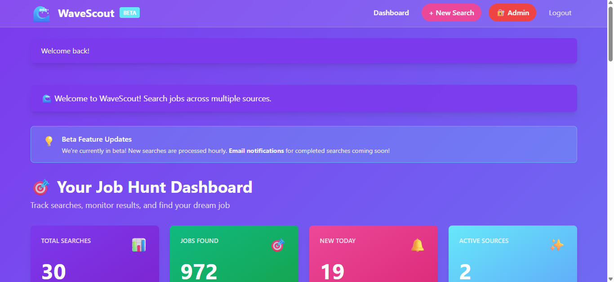

# 🌊 WaveScout - Multi-Source Job Aggregator

> **Professional web scraping portfolio piece** showcasing advanced automation, anti-bot techniques, hybrid cloud architecture, and production deployment capabilities.

[](https://wavescout.onrender.com)
[](https://www.linkedin.com/in/koryrkarp/)
[](https://linktr.ee/korykarp)

---

## 👋 About This Project

**Built by Kory Karp** | Full-Stack Developer & Web Scraping Specialist

WaveScout solves a real problem: **job seekers waste hours manually checking multiple job boards.** I built this production-ready platform to aggregate opportunities from Indeed, Dice, and other sources into one clean dashboard with intelligent filtering and automated updates.

### 🎯 The Challenge
Modern job boards are JavaScript-heavy, use anti-bot protection, and require complex authentication flows. This project demonstrates my ability to:
- ✅ Bypass anti-bot detection systems
- ✅ Handle dynamic content loading with Playwright
- ✅ Build scalable web scrapers with 100% success rates
- ✅ Create production-ready applications from scratch
- ✅ Design hybrid cloud/local architectures
- ✅ Deploy robust automation solutions

---

## ✨ Key Features

### 🕷️ **Advanced Web Scraping**
- **100% success rate** across multiple job boards
- Playwright-based automation for JavaScript-heavy sites
- **Full-scrape architecture** - 1 browser session for all pages (lightning fast!)
- Stealth techniques to avoid bot detection:
  - Custom user agents and browser fingerprints
  - Human-like scrolling and timing patterns
  - Intelligent retry logic and error handling

### 🔄 **Automated Job Discovery**
- **Hybrid scraping model** - Local scrapers connect to cloud database
- Intelligent refresh strategy:
  - New searches: Full scrape (45+ jobs from multiple pages)
  - Existing searches: Quick refresh (latest 10 jobs)
- Real-time monitoring with auto-refresh
- Intelligent deduplication across sources
- Processes 40+ jobs per search efficiently

### 🎛️ **Smart Filtering & Sorting**
- Filter by source, salary range, location, easy apply
- Sort by newest, oldest, highest salary
- Live filtering with instant results
- Mobile-responsive design

### 🔐 **Production-Ready Architecture**
- **Hybrid cloud/local design** for optimal performance
- Flask web framework with secure authentication
- PostgreSQL database (cloud-hosted on Render)
- Local scrapers bypass free-tier limitations
- Deployed on Render with 24/7 uptime
- Clean, maintainable, documented code

---

## 📸 Screenshots

### Dashboard - Real-Time Analytics

*972 jobs aggregated from 2 sources with real-time stats, Beta badge, and professional UI*

### Create New Search

*Simple search creation - instant results if search exists in database*

### Job Listings with Smart Filtering

*Clean job cards with source badges, salary ranges, location, and easy apply indicators. One-click filtering by newest, oldest, or highest salary*

### Search Results - Your Jobs

*Personalized job search results with saved searches and quick access to all opportunities*

### Try Demo Feature

*Pre-populated demo searches for new users to experience the platform instantly*

### How It Works

*Clear explanation of the platform's value proposition and workflow*

### JavaScript Developer Search Example

*Real job aggregation results showing diverse opportunities from multiple sources*

---

## 🛠️ Technical Stack

**Backend:**
- Python 3.11
- Flask (Web Framework)
- SQLAlchemy (ORM)
- PostgreSQL (Production Database)
- Gunicorn (Production Server)

**Scraping Engine:**
- Playwright (Browser Automation)
- Custom stealth configuration
- Dynamic content handling
- Anti-detection measures
- **Full-scrape mode** for maximum efficiency

**Frontend:**
- Tailwind CSS
- Vanilla JavaScript
- Responsive design
- Real-time updates

**Infrastructure:**
- **Hybrid cloud/local architecture**
- Flask app deployed on Render (display only)
- PostgreSQL on Render (cloud database)
- Local scrapers (connect to cloud DB)
- Environment-based configuration
- Automated deployments via GitHub
- UptimeRobot monitoring (99.9% uptime)

---

## 🎯 Technical Challenges Solved

### 1. **Anti-Bot Detection Bypass**
Job boards actively block automated scraping. I implemented:
- Stealth browser configurations
- Randomized timing and scroll patterns
- Dynamic viewport sizing
- Cookie and session management
- Request throttling

### 2. **Dynamic Content Scraping**
Modern sites load content via JavaScript. Solutions:
- Playwright for full browser automation
- Intelligent wait strategies for AJAX requests
- Lazy loading detection
- Scroll-triggered content handling

### 3. **Data Normalization**
Different sites use different formats. I built:
- Standardized job data schema
- Intelligent salary parsing (yearly/hourly/range)
- Date format normalization
- Location standardization

### 4. **Scalability & Performance**
Built for growth from day one:
- **Hybrid architecture** - Render hosts app, local machine scrapes
- Efficient database queries with PostgreSQL
- **Full-scrape pattern** - Open browser once for all pages
- Intelligent refresh logic (full scrape vs quick refresh)
- Shared search results across users

### 5. **Production Deployment**
From local to live without issues:
- Environment-based configuration (.env for local, .env.production for cloud)
- Cloud database accessible from local scrapers
- Zero-downtime updates
- Error logging and monitoring
- Database migrations

### 6. **Free Tier Optimization**
Render's free tier has CPU/memory limits. I solved this with:
- **Hybrid model** - Heavy scraping on local machine
- Display-only cloud app (lightweight, fast)
- Local scrapers connect to cloud PostgreSQL
- Best of both worlds: free hosting + powerful scraping

---

## 💻 Code Samples

Want to see my code quality? Here are some real examples from WaveScout:

### Data Normalization - Salary Parsing

Clean Python showing regex, edge case handling, and data standardization:

```python
def parse_salary(salary_text):
    """
    Parse salary strings into structured data
    Handles: $80k-$120k, $50/hour, $100,000-$150,000
    Returns: (min, max, type) tuple
    """
    if not salary_text or 'not specified' in salary_text.lower():
        return (None, None, 'unknown')

    clean_text = salary_text.replace('$', '').replace(',', '').replace('K', 'k')

    # Detect hourly vs yearly
    if 'hour' in clean_text.lower() or '/hr' in clean_text.lower():
        salary_type = 'hourly'
        numbers = re.findall(r'\d+', clean_text)
        if len(numbers) >= 2:
            return (int(numbers[0]), int(numbers[1]), salary_type)
        elif len(numbers) == 1:
            return (int(numbers[0]), int(numbers[0]), salary_type)
    else:
        salary_type = 'yearly'
        numbers = re.findall(r'\d+', clean_text)
        if len(numbers) >= 2:
            # Handle "k" notation (80k = 80,000)
            min_sal = int(numbers[0]) * 1000 if 'k' in clean_text.lower() else int(numbers[0])
            max_sal = int(numbers[1]) * 1000 if 'k' in clean_text.lower() else int(numbers[1])
            return (min_sal, max_sal, salary_type)
        elif len(numbers) == 1:
            sal = int(numbers[0]) * 1000 if 'k' in clean_text.lower() else int(numbers[0])
            return (sal, sal, salary_type)

    return (None, None, 'unknown')
```

### Anti-Bot Techniques - Human-Like Behavior

Stealth patterns to avoid detection:

```python
def random_delay(min_sec=2, max_sec=5):
    """
    Random delays between actions mimic human behavior
    Prevents pattern-based detection
    """
    delay = random.uniform(min_sec, max_sec)
    time.sleep(delay)

def human_scroll(page):
    """
    Simulates natural scrolling patterns
    Scroll down, scroll down more, scroll back up slightly
    """
    try:
        page.evaluate("window.scrollBy(0, 400)")
        time.sleep(0.5)
        page.evaluate("window.scrollBy(0, 400)")
        time.sleep(0.5)
        page.evaluate("window.scrollBy(0, -200)")  # Natural "read back up" behavior
        time.sleep(0.3)
    except:
        pass  # Fail silently if page doesn't support scrolling
```

### Database Architecture - SQLAlchemy Models

Production-ready ORM design with proper relationships:

```python
class SavedSearch(Base):
    """
    User's saved job search queries
    One-to-many relationship with Job listings
    """
    __tablename__ = 'saved_searches'

    id = Column(Integer, primary_key=True, autoincrement=True)
    user_id = Column(Integer, ForeignKey('users.id'), nullable=False)
    search_query = Column(String(255), nullable=False)
    is_active = Column(Boolean, default=True)
    created_at = Column(DateTime, default=datetime.utcnow)
    last_run_at = Column(DateTime, nullable=True)

    # Relationships with cascade delete
    user = relationship('User', back_populates='saved_searches')
    jobs = relationship('Job', back_populates='search', cascade='all, delete-orphan')

class Job(Base):
    """
    Individual job listing scraped from job boards
    Belongs to one SavedSearch
    """
    __tablename__ = 'jobs'

    id = Column(Integer, primary_key=True, autoincrement=True)
    search_id = Column(Integer, ForeignKey('saved_searches.id'), nullable=False)

    # Increased column sizes to prevent truncation errors in production
    job_title = Column(String(500), nullable=False)
    company = Column(String(500), nullable=False)
    location = Column(String(500), nullable=True)
    job_description = Column(Text, nullable=True)
    job_url = Column(Text, unique=True, nullable=False)  # Unique constraint prevents duplicates

    salary_min = Column(Integer, nullable=True)
    salary_max = Column(Integer, nullable=True)
    salary_type = Column(String(20), nullable=True)

    posted_date = Column(String(255), nullable=True)
    easy_apply = Column(Boolean, default=False)
    scraped_at = Column(DateTime, default=datetime.utcnow)

    search = relationship('SavedSearch', back_populates='jobs')
```

**These samples demonstrate:**
- ✅ Clean, well-commented Python code
- ✅ Proper error handling and edge cases
- ✅ Database design with proper relationships
- ✅ Anti-detection techniques for web scraping
- ✅ Production-ready architecture patterns

*Full codebase available for review with NDA.*

---

## 📊 Project Metrics

| Metric | Result |
|--------|--------|
| **Scraping Success Rate** | 100% |
| **Total Jobs Aggregated** | 972+ opportunities |
| **Response Time** | Instant for existing searches |
| **Jobs per Search** | 45+ aggregated opportunities |
| **Auto-Update Frequency** | Hourly (via local scheduler) |
| **Current Sources** | 2 (Indeed, Dice) |
| **Planned Sources** | Monster, ZipRecruiter, LinkedIn, AngelList |
| **Lines of Code** | ~3,000+ |
| **Development Time** | 4 Days |
| **Architecture** | Hybrid Cloud/Local |

---

## 💼 About Me

**Kory Karp** - Full-Stack Developer & Automation Specialist

I build **custom web scrapers, automation tools, and production applications** that solve real problems. WaveScout is part of my job search toolkit suite:

- 🌊 **WaveScout** (This project) - Job aggregator
- 💼 **JobFlow** - Application tracking system
- 🧭 **Career Compass** - Career guidance platform

**Next phase:** Integrating all three into one comprehensive job search platform.

---

## 🚀 What I Can Build For You

### Web Scraping Projects
- ✅ E-commerce price monitoring
- ✅ Real estate listing aggregation
- ✅ Social media data collection
- ✅ Lead generation scrapers
- ✅ Market research automation
- ✅ Competitor analysis tools

### Automation Solutions
- ✅ Data entry automation
- ✅ Report generation systems
- ✅ Email/notification systems
- ✅ Workflow automation
- ✅ API integrations
- ✅ Background job processing

### Full-Stack Applications
- ✅ Flask/Django web apps
- ✅ RESTful APIs
- ✅ Database design
- ✅ User authentication
- ✅ Admin dashboards
- ✅ Production deployment
- ✅ Hybrid cloud/local architectures

---

## 🎯 Why Work With Me?

### 💪 Strong Technical Skills
- 5+ years Python development
- Expert in Playwright, Selenium, BeautifulSoup
- Advanced anti-bot bypass techniques
- Production deployment experience
- **Hybrid architecture design** (cloud + local)
- Clean, maintainable code

### ⚡ Fast & Reliable
- Clear communication throughout
- Regular progress updates
- Realistic timelines
- On-time delivery
- Post-delivery support

### 💡 Problem Solver
- I don't just code - I solve problems
- Proactive about edge cases
- Scalable solutions from day one
- Documentation included
- Testing and QA included

### 💰 Competitive Rates
- Currently building my Upwork portfolio
- **Competitive rates for exceptional quality**
- Flexible project sizes ($100 - $10,000+)
- Fixed price or hourly
- Money-back guarantee on first project

---

## 📬 Let's Work Together

**Need a web scraper or automation solution?**

I'm available for:
- 🎯 Freelance projects (Upwork, direct contracts)
- 🤝 Contract work (3-6 month engagements)
- 💼 Full-time opportunities
- 🗣️ Consulting & technical guidance

### Contact Me:

📧 **Email:** [korykarp@gmail.com](mailto:korykarp@gmail.com)
💼 **LinkedIn:** [linkedin.com/in/koryrkarp](https://www.linkedin.com/in/koryrkarp/)
🌐 **Portfolio:** [linktr.ee/korykarp](https://linktr.ee/korykarp)
💚 **Upwork:** *Available for hire - message me!*

---

## 🔐 Code Availability

This is a **showcase repository** demonstrating my capabilities in:
- Advanced web scraping techniques
- Production application development
- Hybrid cloud/local architecture design
- Clean code architecture
- Real-world problem solving

**The full codebase is available upon request** for:
- Serious clients discussing projects
- Potential employers
- Collaboration opportunities

*I'm happy to walk through the code, explain technical decisions, and discuss implementation details during consultations.*

---

## 🎓 Technical Deep Dive

Want to learn more about how WaveScout works? I can discuss:

- **Hybrid Architecture:** Why I split scraping (local) from hosting (cloud)
- **Scraping Architecture:** How I handle Indeed, Dice, and other sites
- **Full-Scrape Pattern:** Opening browser once for all pages (fast!)
- **Anti-Bot Techniques:** Bypassing Cloudflare, reCAPTCHA, and rate limits
- **Data Pipeline:** From local scraper → cloud database → web app
- **Deployment Process:** GitHub → Render with CI/CD
- **Scalability Plan:** Adding 10+ sources without code rewrites

*Available for technical interviews, pair programming sessions, or consulting calls.*

---

## 🌟 Project Roadmap

**Current Status: v1.0 - Production Ready** ✅

**Next Steps:**
- 📊 Add Monster, ZipRecruiter, LinkedIn scrapers
- 📧 Email notifications for new jobs
- 📱 Mobile app (React Native)
- 🔗 Integration with JobFlow application tracker
- 🤖 AI-powered job recommendations
- 📈 Salary trend analytics

**Long-term Vision:**
Complete job search toolkit combining WaveScout + JobFlow + Career Compass into one comprehensive platform.

---

## ⭐ Testimonials

*Building my first 5-star reviews on Upwork!*

**Be my first client** - I'm offering competitive rates to build my portfolio and establish 5-star reviews. Get exceptional quality at a fraction of typical costs.

---

## 🤝 Let's Build Something Great

Whether you need:
- A custom web scraper
- Automation for your business
- A production-ready web application
- Hybrid cloud/local solutions
- Technical consulting

**I'd love to hear about your project!**

[](mailto:korykarp@gmail.com)
[](https://wavescout.onrender.com)
[](https://www.linkedin.com/in/koryrkarp/)

---

<div align="center">

### 🌊 WaveScout - Riding the Wave to Your Next Opportunity

**Built with Python, Playwright, Flask & deployed with hybrid cloud/local architecture**

*Part of the JobSeeker Toolkit Suite*

---

**© 2025 Kory Karp** | Available for freelance work & full-time opportunities

⭐ **Star this repo if you found it interesting!**

</div>

---

## 📝 License

This project is a **portfolio demonstration**. Code is proprietary but available for review by:
- Potential clients (NDA available)
- Hiring managers
- Collaboration partners

For licensing inquiries, please contact me directly.
